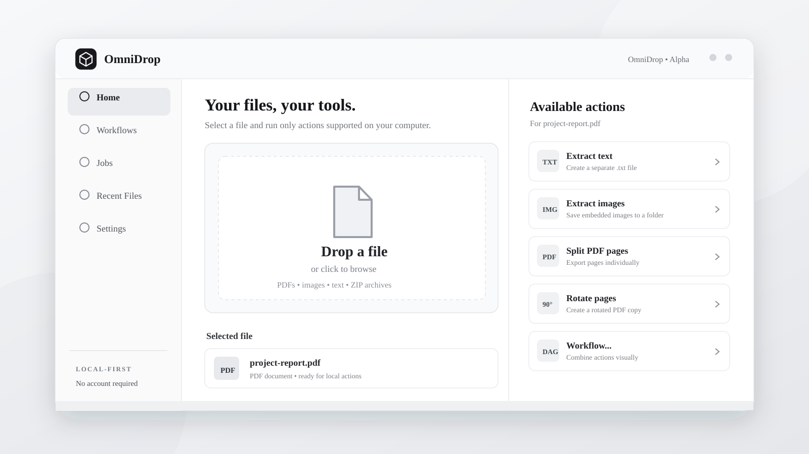
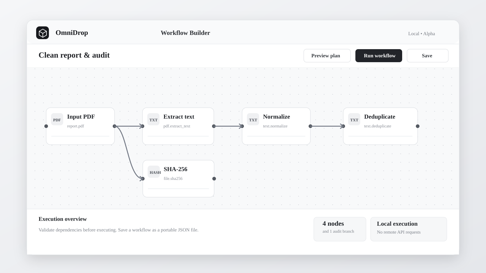
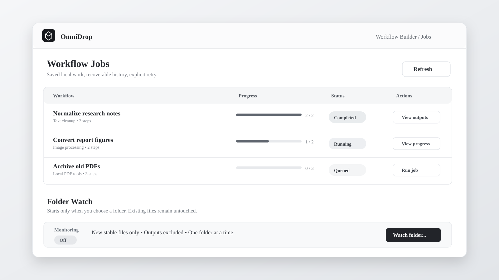

# OmniDrop · 中文介绍

<p align="right"><a href="../README.md">English README</a></p>

**一个专注、高效、可扩展的本地文件处理工作台。**

把文件拖进来，OmniDrop 会识别文件类型，只展示当前环境真正可用的操作。你可以单独转换、清理文件，也可以把操作连接成可复用的可视化工作流。

> **一个入口，处理文件；一个工作流，自动重复。** 默认本地处理、尽量保留原文件，云端功能由用户明确选择。



<p align="center"><sub>界面预览 · 实际布局以所安装的 Alpha 版本为准。</sub></p>

**当前阶段：v0.3.0 Alpha（Windows x64 预览版）**

[下载 Windows Alpha](https://github.com/stloendays/OmniDrop-Alpha/releases/tag/v0.3.0) · [工作流文档](WORKFLOWS.md) · [功能清单](ACTIONS.md) · [开发路线图](ROADMAP.md) · [提交问题](https://github.com/stloendays/OmniDrop-Alpha/issues)

## OmniDrop 有什么特别之处？

它不是另一个 Office 套件，而是把零散的文件处理工具统一到一个清晰界面。

- **识别文件，再显示操作：** 拖入文件后，按格式及当前依赖的可用性筛选操作，缺失的处理器不会被伪装成可用。
- **一切操作有迹可循：** 保留最近文件与活动记录；批处理、工作流可以显示进度。
- **可视化自动化：** 在 DAG 画布中创建分支和汇合、验证依赖，保存为可复用的 `.omniworkflow.json`。
- **任务持久化：** Jobs 记录任务状态，失败或中断后可由用户明确重新运行整条流程。
- **文件夹自动触发：** 用户主动启用，处理新出现且写入稳定的文件，排除生成结果，避免无限循环。
- **GUI 与 CLI 语义一致：** C++20 / Qt 6 桌面应用、命令行共用应用服务与稳定 Action ID。

## 已实现的能力

| 场景 | 当前可用功能 |
| --- | --- |
| 文本与开发文件 | 规范化文本、去除重复行、JSON/XML 格式化、计算 SHA-256 |
| 重复文件检测 | 对选定文件按大小与 SHA-256 核对重复内容，生成不删除原文件的 JSON 报告 |
| 批量重命名预览 | 支持查找替换、正则、冲突检测与原/新文件名对照；不会实际重命名 |
| 图片 | 压缩、转换 WebP、去元数据、旋转 90°、按 50% 缩放 |
| PDF | 提取文本与内嵌图片、分割页面、合并多个 PDF、旋转页面 |
| ZIP | 检查内容、安全解压 |
| 批处理与 Workflow | 多文件处理、可视化 DAG、实时进度、文件间安全停止、持久化 Jobs |
| 翻译（可选） | 离线 Argos；或经用户明确同意的 MyMemory、LibreTranslate、DeepL API Free |
| 语音（可选） | 额外安装并校验 Piper 语音模型后，将文本或字幕转为本地 WAV |

**版本说明：** 以上功能以当前 `main` 源码为准，`v0.3.0` Alpha 发布后新增的功能需等待新的构建或下一次正式测试包发布。

实际可用性取决于本机的依赖、文件类型和已安装的可选组件。**尚未支持的 Office 文件布局级编辑、OCR、完整视频编辑和自动更新不能当作已完成功能。** 请参阅 [Action 清单](ACTIONS.md)。

[批量重命名预览说明](BATCH_RENAME_PREVIEW.md)

## Windows 快速开始

1. 打开 [v0.3.0 Release](https://github.com/stloendays/OmniDrop-Alpha/releases/tag/v0.3.0)，下载 `OmniDrop-0.3.0-windows-dev.zip` 和同名 `.sha256` 校验文件。
2. 对比 ZIP 的 SHA-256，解压到专用文件夹，例如 `C:\Apps\OmniDrop`（不要直接解压到 Git 工作区）。
3. 无需单独安装 Python：软件包已内置经过 SHA-256 验证的 CPython 3.13.16。高级用户仍可通过 `OMNIDROP_PYTHON` 指定外部解释器。
4. 双击 `OmniDrop.exe`，拖入文件并选择推荐操作。

当前 ZIP 包含 Qt、独立的 Python 解释器及 Pillow/pypdf 等核心依赖，但**不自带可选语音模型或离线翻译模型**；也不是 Windows Authenticode 签名安装器。ZIP 有 SHA-256 校验和 GitHub 签名构建来源证明。

## 三个典型用法

**直接处理文件：** 拖入图片、PDF、ZIP 或文本 → 查看可用操作 → 执行 → 得到新的输出文件。

**组合工作流：** 打开 **Workflow...** → 从线性步骤切换到 DAG 节点图 → 连接动作 → **Preview plan** 预览 → 执行或保存。



**监控新文件：** 在 Workflow 中点击 **Watch folder...**，手动指定文件夹。仅识别会话期间进入的稳定文件；关闭编辑器后不会自动继续监听。详情见 [文件夹监控文档](WORKFLOW_WATCH.md)。



在 ZIP 解压目录中，也可使用 CLI：

```powershell
.\omnidrop-cli.exe --version
.\omnidrop-cli.exe actions C:\Files\example.pdf
.\omnidrop-cli.exe workflow validate .\workflows\examples\text-clean.omniworkflow.json
.\omnidrop-cli.exe workflow run .\workflows\examples\text-clean.omniworkflow.json C:\Files\notes.txt
```

工作流中的 `notes.txt` 为示例文件，请替换为真实路径。

## 本地优先与隐私

基本文件处理无需账户，也不会自动上传文件。生成式语音需要用户自行安装经过校验的本地模型。在线翻译需要明确授权，可能受第三方服务额度和隐私条款约束。[翻译说明](TRANSLATION.md) · [语音模型说明](VOICE_PACKS.md)。

**安全边界：** 默认非破坏性输出；只有用户主动开启文件夹监控才会处理新文件；工作流不允许任意 Shell 命令或隐式远程 API 调用。Alpha 版本仍应先使用非关键数据进行测试。

## 技术与参与开发

```text
Qt GUI / CLI
     │
C++ Application Services + Action Catalog
     │
Adapters / Python worker / Optional local models
     │
New output files + Jobs history
```

- 技术栈：C++20、Qt 6、Python、CMake、CTest
- Windows：提供 Alpha 便携包，运行完整 GUI/CLI CI
- Linux：持续运行 core/CLI 测试；目前不提供正式 Linux 桌面安装包
- 代码架构：[ARCHITECTURE.md](ARCHITECTURE.md)
- 贡献说明：[CONTRIBUTING.md](../CONTRIBUTING.md)
- 漏洞反馈：[SECURITY.md](../SECURITY.md)
- 开发计划：[ROADMAP.md](ROADMAP.md)

你可以提出使用体验、功能建议或提交 PR。欢迎对 Windows C++ / Qt、Python 文件处理、自动化工作流、测试和文档感兴趣的贡献者。

**授权协议：** [MIT](../LICENSE)。图像展示位已预留，将在后续有可核验的软件截图后添加。
